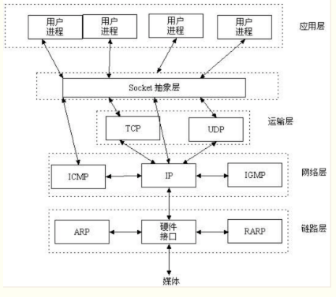
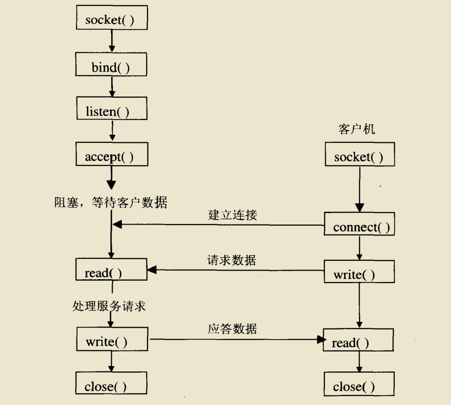

# WEB服务器编程实现
本实训将首先利用 **Python** 实现面向TCP连接的套接字编程基础知识：如何创建套接字，将其绑定到特定的地址和端口，以及发送和接收数据包。其次还将学习 **HTTP** 协议格式的相关知识。在此基础上，本实训将用 **Python** 语言开发一个简单的 **Web** 服务器，它仅能处理一个 **HTTP** 连接请求。  
**Web** 服务器的基本功能是接受并解析客户端的 **HTTP** 请求，然后从服务器的文件系统获取所请求的文件，生成一个由头部和响应文件内容所构成成的 **HTTP** 响应消息，并将该响应消息发送给客户端。如果请求的文件不存在于服务器中，则服务器应该向客户端发送 `404 Not Found` 差错报文。  
具体的过程分为：  
- 当一个客户（浏览器）连接时，创建一个连接套接字；
- 从这个连接套接字接收 **HTTP** 请求；
- 解释该请求以确定所请求的特定文件；
- 从服务器的文件系统获得请求的文件；
- 创建一个由请求的文件组成的 **HTTP** 响应报文，报文前面有首部行；
- 经 **TCP** 连接向请求浏览器发送响应。
- 如果浏览器请求一个在该服务器中不存在的文件，服务器应当返回一个 `404 Not Found` 差错报文。

---

要实现 **Web** 服务器，需使用套接字 **Socket** 编程接口来使用操作系统提供的网络通信功能。  
**Socket** 是应用层与 **TCP/IP** 协议族通信的中间软件抽象层，是一组编程接口。它把复杂的 **TCP/IP** 协议族隐藏在 **Socket** 接口后面，对用户来说，一组简单的接口就是全部，让 **Socket** 去组织数据，以符合指定的协议。使用 **Socket** 后，无需深入理解 **TCP/UDP** 协议细节（因为 **Socket** 已经为我们封装好了），只需要遵循 **Socket** 的规定去编程，写出的程序自然就是遵循 **TCP/UDP** 标准的。 **Socket** 的地位如下图所示：

 从某种意义上说， **Socket** 由地址 **IP** 和端口 **Port** 构成。 **IP** 是用来标识互联网中的一台主机的位置，而 **Port** 是用来标识这台机器上的一个应用程序， **IP** 地址是配置到网卡上的，而 **Port** 是应用程序开启的， **IP** 与 **Port** 的绑定就标识了互联网中独一无二的一个应用程序。

 ---

### 套接字类型
- 流式套接字（`SOCK_STREAM`）：用于提供面向连接、可靠的数据传输服务。  
- 数据报套接字（`SOCK_DGRAM`）：提供了一种无连接的服务。该服务并不能保证数据传输的可靠性，数据有可能在传输过程中丢失或出现数据重复，且无法保证顺序地接收到数据。  
- 原始套接字（`SOCK_RAW`）：主要用于实现自定义协议或底层网络协议。

在本 WEB 服务器程序实验中，采用流式套接字进行通信。其基本模型如下图所示：

其工作过程如下：服务器首先启动，通过调用 `socket()` 建立一个套接字，然后调用绑定方法 `bind()` 将该套接字和本地网络地址联系在一起，再调用  `listen()` 使套接字做好侦听连接的准备，并设定的连接队列的长度。客户端在建立套接字后，就可调用连接方法 `connect()` 向服务器端提出连接请求。服务器端在监听到连接请求后，建立和该客户端的连接，并放入连接队列中，并通过调用 `accept()` 来返回该连接，以便后面通信使用。客户端和服务器连接一旦建立，就可以通过调用接收方法 `recv()／recvfrom()` 和发送 方法`send()／sendto()` 来发送和接收数据。最后，待数据传送结束后，双方调用 `close()` 关闭套接字。