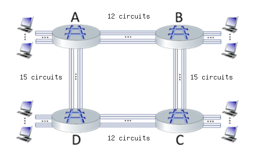

# CIRCUIT SWITCHING ｜ 电路交换
Consider the circuit-switched network shown in the figure below, with circuit switches A, B, C, and D. Suppose there are 12 circuits between A and B, 15 circuits between B and C, 12 circuits between C and D, and 15 circuits between D and A.  
请参考下图的电路交换网络，电路交换机为A、B、C和D。假设A和B之间有12条电路，B和C之间有15条电路，C和D之间有12条电路，D和A之间有15条电路。

---

### 1. What is the maximum number of connections that can be ongoing in the network at any one time?  
> **Hint:** The maximum number of connections is the sum of all links  
> *Answer:* 54  
> **答案:** 54  
> **解释:** 网络中最大连接数等于所有链路的电路数量之和：  
12 (A-B) + 15 (B-C) + 12 (C-D) + 15 (D-A) = 54

---

### 2. Suppose that these maximum number of connections are all ongoing. What happens when another call connection request arrives to the network, will it be accepted? Answer Yes or No  
> **Hint:** If all connections are full, the request will be blocked  
> **Answer:** No  
> **答案:** 不  
> **解释:** 如果网络中已有最大数量的连接（即54个），再有新的呼叫请求到来时，网络无法接受新的连接，因为所有的电路都已被占用。

---

### 3. Suppose that every connection requires 2 consecutive hops, and calls are connected clockwise. For example, a connection can go from A to C, from B to D, from C to A, and from D to B. With these constraints, what is the maximum number of connections that can be ongoing in the network at any one time?  
> **Hint:** Find the max between the sum of the bottleneck links for cases A->C and B->D, but don't forget about bottleneck links  
> **Answer:** 24  
> **答案:** 24  
> **解释:** 在这个情况下，连接需要两个连续的跳数。因此，要计算每个方向的瓶颈链路数量 
> - 从A到C，需要A-B (12条) 和 B-C (15条) 的链路，所以瓶颈链路是12。
> - 从B到D，需要B-C (15条) 和 C-D (12条) 的链路，所以瓶颈链路是12。
> - 从C到A，需要C-D (12条) 和 D-A (15条) 的链路，所以瓶颈链路是12。
> - 从D到B，需要D-A (15条) 和 A-B (12条) 的链路，所以瓶颈链路是12。
>
> 最大可用连接数 = 12 + 12 = 24。

---

### 4. Suppose that 20 connections are needed from A to C, and 17 connections are needed from B to D. Can we route these calls through the four links to accommodate all 37 connections? Answer Yes or No  
> **Hint:** Taking from the previous question, is the sum of the two connections greater than the value we calculated in question 3?  
> **Answer:** No  
> **答案:** 不  
> **解释:** 根据第3题计算的最大连接数（24条），而从A到C需要20条连接，从B到D需要17条连接，两者相加为37条连接，超过了24条的最大连接数，因此不能通过现有链路承载所有连接。

--- 
