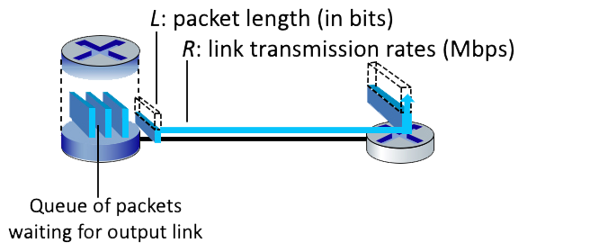

# One-hop Transmission Delay | 单跳传输时延

Consider the figure below, in which a single router is transmitting packets, each of length L bits, over a single link with transmission rate R Mbps to another router at the other end of the link.  
考虑下图，其中单个路由器正在通过传输速率为 R Mbps 的单条链路向链路另一端的路由器传输长度为 L 比特的数据包。

Suppose that the packet length is L= 4000 bits, and that the link transmission rate along the link to the router on the right is R = 1000 Mbps.  
假设数据包长度为 L=4000 比特，而到右侧路由器的链路传输速率为 R = 1000 Mbps。

Round your answer to two decimals after leading zeros  
将你的答案四舍五入到小数点后两位

---

### 1. What is the transmission delay?  传输时延是多少？

> **Hint:** Transmission delay is calculated by L / R  
> **提示:** 传输时延由 L / R 计算  
> **Answer:** 4.00E-6  
> **答案:** 4.00E-6  

---

### 2. What is the maximum number of packets per second that can be transmitted by this link?  该链路每秒最多能传输多少个数据包？

> **Hint:** Use the rate and figure out how many packets can fit in that many bits  
> **提示:** 利用传输速率计算在该速率下可以传输多少个数据包  
> **Answer:** 250000  
> **答案:** 250000  

---
