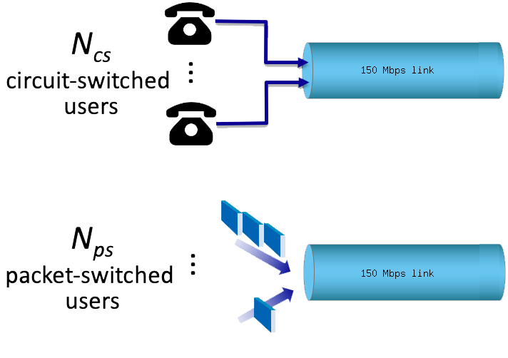

# Quantitative Comparison of Packet Switching and Circuit Switching | 包括分组交换和电路交换的定量比较

This question requires a little bit of background in probability (but we'll try to help you though it in the solutions). Consider the two scenarios below:  
这个问题需要一些概率的背景知识（但我们会在解答中帮助你理解）。考虑下面的两种场景：

- A circuit-switching scenario in which Ncs users, each requiring a bandwidth of 10 Mbps, must share a link of capacity 150 Mbps.  
  电路交换场景，其中Ncs用户，每个用户需要10 Mbps的带宽，共享150 Mbps的链路。

- A packet-switching scenario with Nps users sharing a 150 Mbps link, where each user again requires 10 Mbps when transmitting, but only needs to transmit 10 percent of the time.  
  分组交换场景，其中Nps用户共享一个150 Mbps的链路，每个用户在传输时需要10 Mbps，但只有10%的时间需要传输。

---

### 1. When circuit switching is used, what is the maximum number of users that can be supported? 当使用电路交换时，最多可以支持多少个用户？

> **Hint:** Circuit users can't share bandwidth  
> **提示:** 电路交换用户无法共享带宽  
> **Answer:** 15  
> **答案:** 15

---

### 2. Suppose packet switching is used. If there are 29 packet-switching users, can this many users be supported under circuit-switching? Yes or No. 假设使用分组交换。如果有29个分组交换用户，电路交换是否可以支持这么多用户？是或否。

> **Hint:** How much bandwidth does each user need? Is this less than the total bandwidth?  
> **提示:** 每个用户需要多少带宽？是否小于总带宽？  
> **Answer:** No  
> **答案:** 否

---

### 3. Suppose packet switching is used. What is the probability that a given (specific) user is transmitting, and the remaining users are not transmitting? 假设使用分组交换。一个给定的（特定的）用户正在传输，其余用户不传输的概率是多少？

> **Hint:** Start with calculating the likelihood nobody is transmitting  
> **提示:** 从计算没有用户传输的可能性开始  
> **Answer:** 0.0052  
> **答案:** 0.0052

---

### 4. Suppose packet switching is used. What is the probability that one user (any one among the 29 users) is transmitting, and the remaining users are not transmitting? 假设使用分组交换。一个用户（29个用户中的任何一个）正在传输，其余用户不传输的概率是多少？

> **Hint:** The probability will be higher than the previous question  
> **提示:** 这个概率会比上一个问题的概率更高  
> **Answer:** 0.15  
> **答案:** 0.15

---

### 5. When one user is transmitting, what fraction of the link capacity will be used by this user? Write your answer as a decimal. 当一个用户正在传输时，这个用户将占用链路带宽的多少比例？请以小数形式写出答案。

> **Hint:** The share is capacity / user's bandwidth  
> **提示:** 该用户的带宽 / 链路的总带宽  
> **Answer:** 0.067  
> **答案:** 0.067

---

### 6. What is the probability that any 17 users (of the total 29 users) are transmitting and the remaining users are not transmitting? 什么是任意17个用户（在29个用户中）正在传输，而其余用户不传输的概率？

> **Hint:** You will need to use a binomial distribution  
> **提示:** 你需要使用二项分布  
> **Answer:** 1.47E-10  
> **答案:** 1.47E-10

---

### 7. What is the probability that more than 15 users are transmitting? 什么是更多于15个用户正在传输的概率？

> **Hint:** Take the sum of all probabilities for x active users above 15  
> **提示:** 求所有x个活跃用户超过15的概率的总和  
> **Answer:** 1.88E-9  
> **答案:** 1.88E-9

---
